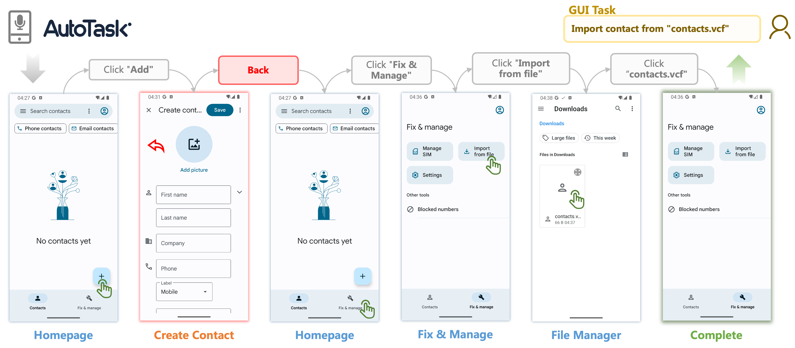

# 📱AutoTask: Executing Arbitrary Voice Commands by Exploring and Learning from Mobile GUI

  



This repository contains the source code for `AutoTask`

`AutoTask` is a system that can automatically execute arbitrary voice commands by exploring and learning from mobile GUI based on Large Language Models (LLMs).

## Quick Start

`AutoTask` is built and tested in Android devices. To use `AutoTask`, you need to follow the steps below:

### Install Front-end

- Download the apk file in the release page and install it in your Android device. (We recommend using Android emulator to run `AutoTask`, which is the experimental environment we used in evaluation. Android emulator can be downloaded from [here](https://developer.android.com/studio/run/emulator) in Android Studio.)
- Open the app and grant the required permissions to start the ActionRecord service.
- Connect your Android device to your computer via USB cable (if you use a real device, if you use Android emulator, you **do not** need to do this step), enter `adb reverse tcp:5002 tcp:5002` in the command line to forward the port.

### Start Back-end

- Install dependencies: `pip install -r requirements.txt`
- Start the back-end server: `python main.py --task "[YOUR_TASK]"` (More parameters can be accessed by `python main.py --help`)
- Press `Enter` to start the exploration process.

### Notes

If you are using OpenAI models (such as the default `gpt-3.5-turbo`), please obtain an OpenAI API key on their [website](https://platform.openai.com/) then set the environment variable `OPENAI_API_KEY` to your API key by running the following command in your terminal:

```bash
export OPENAI_API_KEY=<your key>
```

## Cite

If you use AutoTask in your research, please cite our paper:

```bibtex
@misc{pan2023autotask,
      title={AutoTask: Executing Arbitrary Voice Commands by Exploring and Learning from Mobile GUI}, 
      author={Lihang Pan and Bowen Wang and Chun Yu and Yuxuan Chen and Xiangyu Zhang and Yuanchun Shi},
      year={2023},
      eprint={2312.16062},
      archivePrefix={arXiv},
      primaryClass={cs.HC}
}

```
